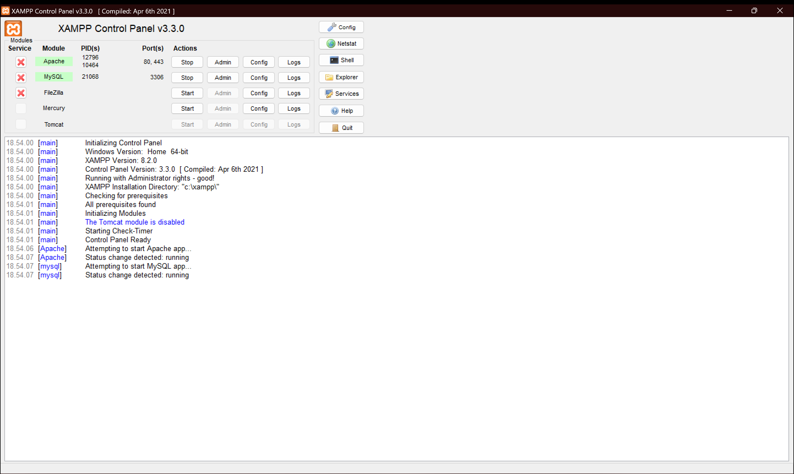
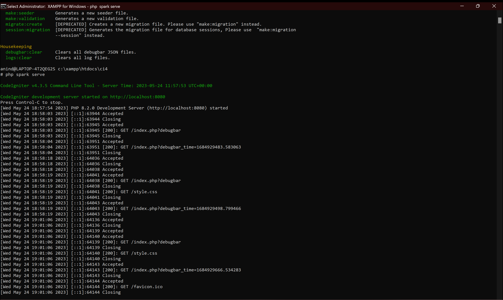

# Lab7web2

## Profil
| #               | Biodata              |
| --------------- | -----------------    |
| **Nama**        | Anindia Sasikirana   |
| **NIM**         | 312110268            |
| **Kelas**       | TI.21.A.2            |
| **Mata Kuliah** | Pemrograman Web 2    |

# konfigurasi untuk penggunaan codeigniter 4

1. download codeigniter4 yang bisa didownload pada codeigniter.com

2. buat folder lab11_ci pada htdocs lalu masukkan file codeigniter yang sudah di ekstrak

3. rename folder codeigniter yang awalnya codeigniter4-framework-v4.... menjadi ci4

4. pada folder ci4 cari file bernama env kemudian rename menjadi .env

5. buka file .env kemudian ubah CI_ENVIRONMENT = production menjadi CI_ENVIRONMENT = development kemudian save

# konfigurasi xampp untuk mengakses codeigniter 4

1. Pertama-tama kita harus membuka aplikasi XAMPP, seterusnya kita pilih "***config***" pada **apache** 
   dan pilih "***php.ini***"
   

2. Kalau sudah klik "***php.ini***" maka cari "***;extension=intl***" kemudian hapus tanda titik koma

3. Lalu start apache dan buka "***shell***" pada xampp kemudian masuk ke directory ci4 yang terdapat didalam folder lab11_ci dalam htdocs xampp. Setelah itu coba tes dengan mengetik "***php spark***" seperti foto yang ada dibawah ini.

4. Kalau sudah, ketik lagi "***php spark serve***" seperti foto yang dibawah ini 

# Dan outputnya akan menjadi seperti ini 

# lalu kita tambahkan 'LOGIN' 

# Terima Kasih
